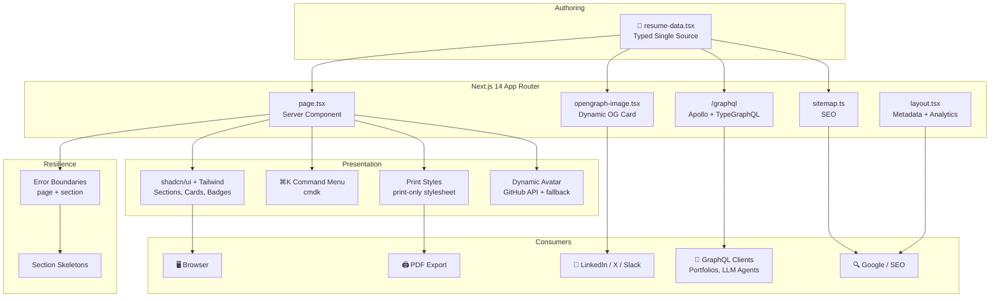

# Resume — A Headless CV Platform

[](https://nextjs.org/)
[](https://react.dev/)
[](https://www.typescriptlang.org/)
[](https://tailwindcss.com/)
[](https://www.apollographql.com/)
[](https://biomejs.dev/)
[](https://www.docker.com/)
[](https://vercel.com/)
[](LICENSE)

> **A headless, single-source-of-truth CV platform.** One typed config drives a print-perfect web resume, an Open Graph card, structured data for SEO, a GraphQL API for downstream apps, and a Cmd+K command palette for recruiters who think in shortcuts.

## ✨ Key Features

- **📝 Single Source of Truth** — All resume content lives in one typed config at [`src/data/resume-data.tsx`](./src/data/resume-data.tsx). Edit once, ship everywhere.
- **🎨 Print-Perfect Layout** — Custom print stylesheet tuned for A4/Letter. `⌘P` produces a clean PDF identical to the web version.
- **⌨️ Command Palette** — `⌘K` / `Ctrl+K` opens a [cmdk](https://github.com/pacocoursey/cmdk)-powered launcher to jump to sections, links, and contact methods.
- **📊 GraphQL API** — Resume data is exposed at [`/graphql`](./src/app/graphql) via Apollo Server + TypeGraphQL, ready to be consumed by portfolios, bots, or LLM agents.
- **🤖 Dynamic Avatar** — GitHub avatar resolver with static fallback ([`src/lib/dynamic-avatar.ts`](./src/lib/dynamic-avatar.ts)) — no manual asset pinning.
- **🔍 SEO + Social** — Auto-generated [`opengraph-image`](./src/app/opengraph-image.tsx), [`sitemap`](./src/app/sitemap.ts), and JSON-LD structured data for rich Google + LinkedIn previews.
- **📱 Responsive by Default** — Mobile, tablet, desktop, and print — all from a single Tailwind layout.
- **🛡️ Resilient UI** — Page-level and section-level [error boundaries](./src/components/error-boundary.tsx) + [skeletons](./src/components/section-skeleton.tsx) so a bad section never breaks the page.
- **⚡ Edge-Ready** — Next.js 14 App Router with Vercel Analytics wired in. Ships fast, stays fast.
- **🐳 Containerized** — `docker compose up -d` and you're hosting your own resume.

## 🏛️ Architecture Overview



## 🚀 Quick Start

### Prerequisites

- Node.js `18+`
- pnpm `8+`

### Install & Run

```bash
git clone https://github.com/sloweyyy/resume.git
cd resume
pnpm install
pnpm dev
```

Open [http://localhost:3000](http://localhost:3000).

### Make It Yours

1. Open [`src/data/resume-data.tsx`](./src/data/resume-data.tsx).
2. Replace `name`, `initials`, `contact`, `work`, `education`, `skills`, `projects`, `awards`.
3. Save. Hot reload picks it up instantly.
4. (Optional) Drop a logo component into [`src/images/logos/`](./src/images/logos/) and reference it in the work entry.

## 📍 Access Endpoints

| Endpoint | Path | Purpose |
| --- | --- | --- |
| **Resume** | [`/`](http://localhost:3000) | Main rendered CV |
| **GraphQL** | [`/graphql`](http://localhost:3000/graphql) | Apollo Server playground + API |
| **Sitemap** | [`/sitemap.xml`](http://localhost:3000/sitemap.xml) | Search engine indexing |
| **OG Image** | [`/opengraph-image`](http://localhost:3000/opengraph-image) | Social preview card |
| **robots.txt** | [`/robots.txt`](http://localhost:3000/robots.txt) | Crawler directives |

## 🛠️ Tech Stack

### Core

| Component | Technology | Purpose |
| --- | --- | --- |
| **Framework** | Next.js 14 (App Router) | SSR, RSC, routing |
| **Language** | TypeScript 5 | Type-safe authoring |
| **Styling** | Tailwind CSS | Utility-first design |
| **Components** | shadcn/ui (Radix UI) | Accessible primitives |
| **Command Palette** | cmdk | `⌘K` navigation |
| **Icons** | lucide-react | Iconography |

### API & Data

| Component | Technology | Purpose |
| --- | --- | --- |
| **GraphQL Server** | Apollo Server 4 | `/graphql` endpoint |
| **Schema** | TypeGraphQL + class-validator | Decorator-driven types |
| **Integration** | `@as-integrations/next` | Next.js route handler |

### Tooling

| Component | Technology | Purpose |
| --- | --- | --- |
| **Linter + Formatter** | Biome | Single-binary replacement for ESLint + Prettier |
| **Package Manager** | pnpm | Fast, disk-efficient installs |
| **Analytics** | Vercel Analytics | Page-level metrics |
| **Container** | Docker + Docker Compose | Reproducible deploys |

## 📦 Project Structure

```text
resume/
│
├── 📁 src/
│   ├── app/                          # Next.js App Router
│   │   ├── page.tsx                  # Main resume page
│   │   ├── layout.tsx                # Root layout, metadata, analytics
│   │   ├── globals.css               # Global + print styles
│   │   ├── loading.tsx               # Loading UI
│   │   ├── opengraph-image.tsx       # Dynamic OG card
│   │   ├── sitemap.ts                # SEO sitemap
│   │   ├── graphql/                  # /graphql route handler
│   │   └── components/               # Page-scoped components
│   │
│   ├── components/                   # Reusable UI
│   │   ├── ui/                       # shadcn/ui primitives
│   │   ├── icons/                    # Icon components
│   │   ├── command-menu.tsx          # ⌘K palette
│   │   ├── avatar.tsx                # Avatar component
│   │   ├── dynamic-avatar.tsx        # GitHub avatar resolver
│   │   ├── error-boundary.tsx        # Page-level boundary
│   │   ├── section-error-boundary.tsx# Section-level boundary
│   │   └── section-skeleton.tsx      # Loading skeletons
│   │
│   ├── data/
│   │   └── resume-data.tsx           # 🔑 Single source of truth
│   │
│   ├── apollo/                       # GraphQL server
│   │   ├── resolvers.ts              # Query resolvers
│   │   └── type-defs.ts              # Schema definitions
│   │
│   ├── lib/                          # Utilities
│   │   ├── types.ts                  # ResumeData type
│   │   ├── utils.ts                  # cn(), helpers
│   │   ├── dynamic-avatar.ts         # Avatar URL resolver
│   │   ├── github-api.ts             # GitHub API client
│   │   └── structured-data.ts        # JSON-LD schema
│   │
│   ├── hooks/                        # React hooks
│   ├── actions/                      # Server actions
│   └── images/logos/                 # Company logos
│
├── 📁 public/                        # Static assets
├── 📄 Dockerfile                     # Production image
├── 📄 docker-compose.yaml            # Local container deploy
├── 📄 biome.json                     # Lint + format config
├── 📄 tailwind.config.js             # Theme extensions
├── 📄 next.config.js                 # Next.js config
└── 📄 CLAUDE.md                      # AI agent guide
```

## 🧠 Architecture Patterns

### Single Source of Truth

All content flows from one typed `RESUME_DATA` object. The page renders it, the GraphQL schema serializes it, the OG card renders excerpts of it, the sitemap references it. There is no second copy to drift.

### Section Isolation

Each section is wrapped in its own [`SectionErrorBoundary`](./src/components/section-error-boundary.tsx) with a [skeleton](./src/components/section-skeleton.tsx) fallback. A malformed `work[3]` entry never takes down the whole page.

### Headless by Default

The same data object that renders the page is queryable at `/graphql`. Build a custom portfolio, a Slack bot, or feed it to an LLM — without re-typing your resume.

### Print-First CSS

Print styles aren't an afterthought — they're a co-equal target. The layout is designed so `⌘P` produces a clean, paginated PDF without manual tweaks.

## 🎨 Customization

### Resume Data

```typescript
// src/data/resume-data.tsx
export const RESUME_DATA: ResumeData = {
  name: "Your Name",
  initials: "YN",
  location: "City, Country",
  about: "One-line tagline",
  summary: <>Multi-paragraph JSX summary…</>,
  contact: { email, tel, social: [...] },
  education: [...],
  work: [...],
  skills: [...],
  projects: [...],
  awards: [...],
}
```

### Theme

- **Colors & tokens**: [`tailwind.config.js`](./tailwind.config.js)
- **Global + print CSS**: [`src/app/globals.css`](./src/app/globals.css)
- **shadcn config**: [`components.json`](./components.json)

### Logos

Drop a React component into [`src/images/logos/`](./src/images/logos/) and reference it from your work entry.

## 🐳 Docker Deployment

```bash
docker compose build
docker compose up -d        # http://localhost:3000
docker compose down
```

Or build the image directly:

```bash
docker build -t resume .
docker run -p 3000:3000 resume
```

## 🧪 Scripts

```bash
pnpm dev          # Start dev server (http://localhost:3000)
pnpm build        # Production build
pnpm start        # Run production build
pnpm lint         # Biome lint
pnpm lint:fix     # Biome lint + auto-fix
pnpm format       # Biome format check
pnpm format:fix   # Biome format write
pnpm check        # Lint + format check
pnpm check:fix    # Lint + format auto-fix
```

> Run `pnpm check:fix` before every commit.

## 🖨️ Print Tips

- Use Chrome / Chromium for the most faithful output.
- Enable **Background graphics** in the print dialog.
- Set margins to **Default**.

## 🚀 Deployment

### Vercel (recommended)

1. Push to GitHub.
2. Import the repo at [vercel.com/new](https://vercel.com/new).
3. Done. Vercel auto-detects Next.js, runs `pnpm build`, and ships it.

### Self-Hosted

Any Node 18+ host works:

```bash
pnpm build
pnpm start
```

Or use the included [`Dockerfile`](./Dockerfile) on Fly.io, Render, Railway, or your own infrastructure.

## 🤝 Contributing

Contributions and forks are welcome.

1. Fork the repo
2. Create a feature branch: `git checkout -b feat/amazing`
3. Commit: `git commit -m "feat: amazing thing"`
4. Push: `git push origin feat/amazing`
5. Open a Pull Request

## 📄 License

MIT — see [LICENSE](LICENSE).

## 🙋 Author

**Truong Le Vinh Phuc** — Product Engineer

- 🌐 [slowey.dev](https://slowey.dev)
- 🐙 [github.com/sloweyyy](https://github.com/sloweyyy)
- 💼 [linkedin.com/in/sloweyne](https://linkedin.com/in/sloweyne)

---
